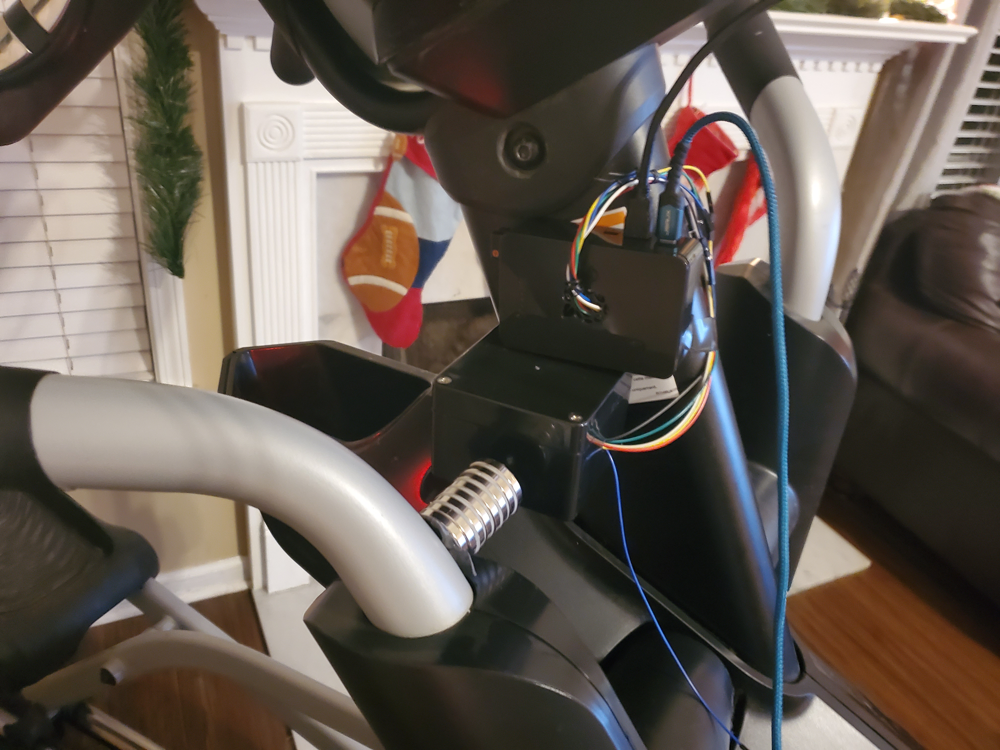
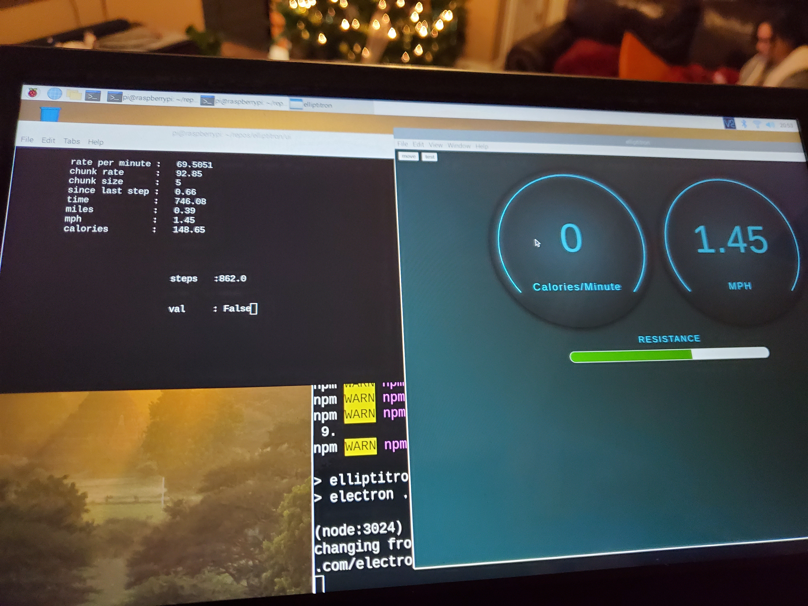

# Elliptitron
This repository is a personal learning project for me. I have a bowflex [bxe216 elliptical machine](https://www.ellipticalreviews.com/bowflex/bxe216/) and I am not fond of it's dashboard or the way it syncs data with the app on my phone.

You can find some images below of the project.

The code is developed on a raspberry pi using [vscode over ssh](https://code.visualstudio.com/docs/remote/remote-overview).

## I have three goals for this project other than learning: 
- sync data real-time as I workout to cloud storage: Google Drive, One Drive, or maybe an azure hosted webservice.
- imrpove the physical dashboard witb a nice UI on a large touch screen
- pause workout as soon as I stop for a break, and resume as soon as I start back

## To hack the hardware or not
I considered tying into the circuitry of the ellipitcal and control it with my own hardware. This style of machine uses a stepper motor to raise and lower a large magnet near a metal flywheel. i.e. If the user increases the resistance during the workout, a magnet is moved closer to the flywheel.

I could control that stepper motor with a raspberry pi. I could also use the pi to measure wheel speed. I assume "incline" is handled a similar way, but I have not dug into it yet.

I chose to not wire into the machine and instead use sensors to read current state and display on the new UI. There are a couple of benefits here:
- Leave the machine intact in case I need a warranty repair or in case I sell it.
- I likely can resuse what I build on a new elliptical 

## Current approach and near-term plan
I'm currently using a raspberry pi 4 for this project. Currently it counts "Strides" pretty well and it will display speed and calories in the UI.

I count strides using a [hall sensor](https://www.amazon.com/gp/product/B085KVV82D/ref=ppx_yo_dt_b_search_asin_image?ie=UTF8&psc=1) to count the number of times a [magnet](https://www.amazon.com/gp/product/B07QW4916R/ref=ppx_yo_dt_b_search_asin_image?ie=UTF8&psc=1) mounted to the elliptical arm passes by.

When I pick the project back up, I plan on using a [proximity sensor](https://www.amazon.com/SainSmart-HC-SR04-Ranging-Detector-Distance/dp/B004U8TOE6/) to detect how close or far away the magnet is, and hence how high or low the resistance is

## Longer-term plan
Sync the data real-time "somewhere."  This really did start because I didn't like the data sync option from Bowlflex, and the dashboard is ugly compared to equipment by Peloton.

## Hardware
- [Bowflex BXE216 elliptical machine](https://www.amazon.com/Bowflex-100506-BXE216-Elliptical/dp/B07864RVS9/)
- [Raspberry Pi 4 ](https://www.amazon.com/gp/product/B07V5JTMV9)
- [10 inch touch screen](amazon.com/gp/product/B0776VNW9C/)
- [hall sensor](https://www.amazon.com/gp/product/B085KVV82D/ref=ppx_yo_dt_b_search_asin_image?ie=UTF8&psc=1)
- [magnet](https://www.amazon.com/gp/product/B07QW4916R/ref=ppx_yo_dt_b_search_asin_image?ie=UTF8&psc=1)

## Software
The code in this respository - it's not the best, but the project is really just a learning experience for me, so I'm not going to beat myself up over it.

- In the UI folder, you will find an Electron + React based user interface.
- In the Server folder, you will find the python code that interacts with Raspberry GPIO pins and a [bottle based](https://bottlepy.org/docs/dev/) webserver 

The server handles the metrics and makes the available to a json webservice.
The UI calls that webservice as often as it needs (once per second currently)

# Some images
#### What electronics project is fun without suspicious looking devices mounted on the side of something?

#### This is a picture of elliptitron "in action."  I promise it works and looks better than this. These are just some photos I have taken along the way.

